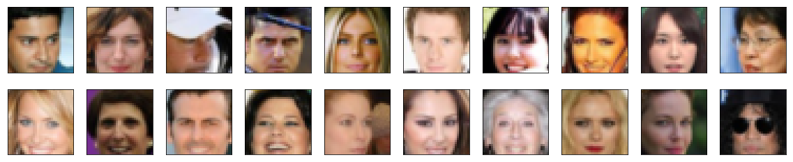
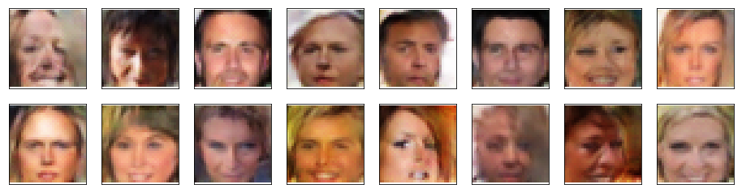

# Generate Faces

GAN model for generating celebrity faces. Part of the coursework for Udacity's Deep Learning Nanodegree.

Real faces (training data):

Fake faces (generated data):

Some of them are wonky but most of them are pretty convincing!
